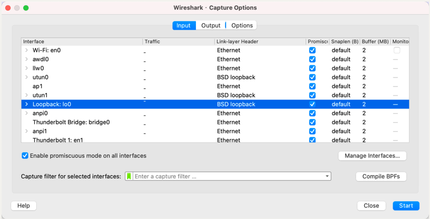
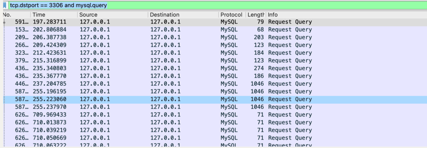

#### 背景

有时候在本地调试mysql的时候需要抓取mysql协议包，我们可以使用 tcpdump、wireshark 等工具。由于wireshark属于界面友好型，所以通常使用wireshark进行抓包。

#### 流程

在本地部署的mysql，客户端和服务端都位于同一台机器，所以需要抓取本地回环网络接口，如下图所示：

然后使用命令过滤mysql数据包：tcp.dstport == 3306 and mysql.query

